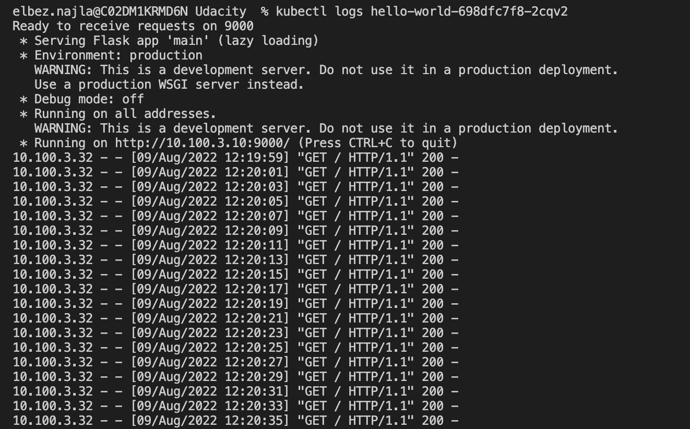
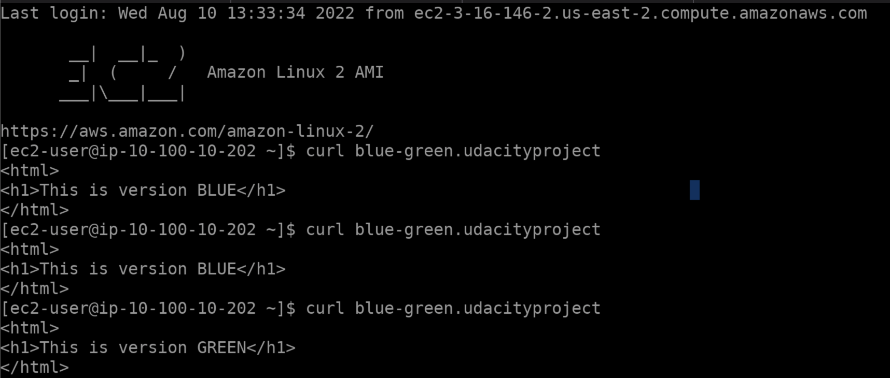
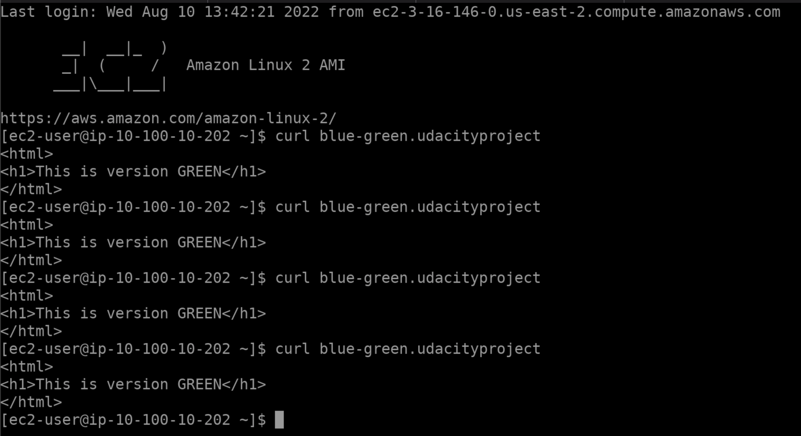
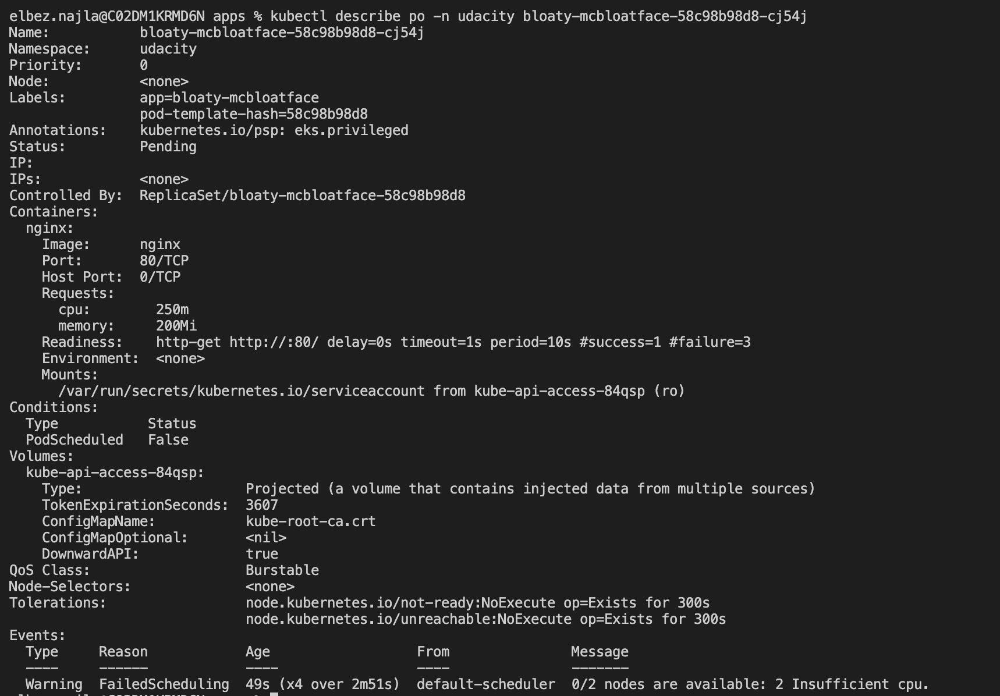
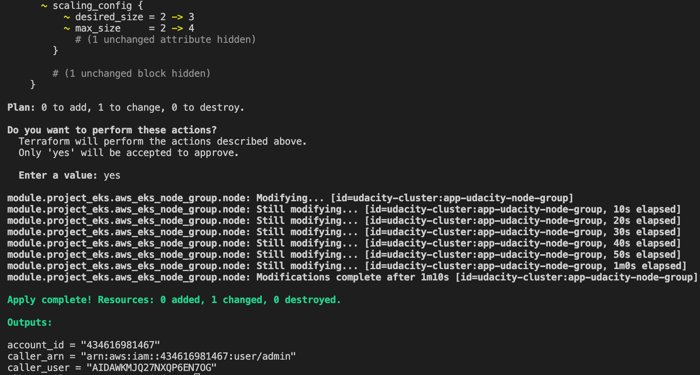

# Project: Deployment Roulette


## Step 1: Deployment Troubleshooting


### Fix the hello-world App Deployment


The `apps/hello-world` deployment is facing deployment issues as the health check was miconfigured 


Screenshot of a successful health check 


```
 kubectl logs hello-world-698dfc7f8-2cqv2
```





## Step 2: Canary Deployments


````
for i in $(seq 1 20); do curl  172.20.191.186; done > canary.txt 
````

## Step 3: Blue-green Deployments

Using the `curl ec2` instance to curl the `blue-green.udacityproject` URL



Commented the resource block creating the record for blue deployment and run `terraform apply`



## Step 4: Node Elasticity

Deploy `apps/bloatware` microservice via `kubectl apply -f bloatware.yml `


### Screenshot of unsuccessful deployment 

The reason why the deployment failed is `0/2 nodes are available: 2 Insufficient cpu.`


### Resolution steps

Edit `eks.tf` 

````
  nodes_desired_size = 3
  nodes_max_size     = 4
  nodes_min_size     = 1
````

Run `terraform apply` 

