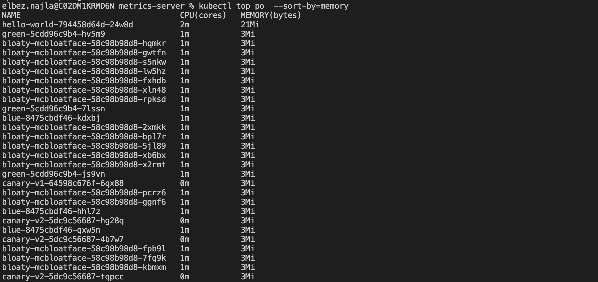
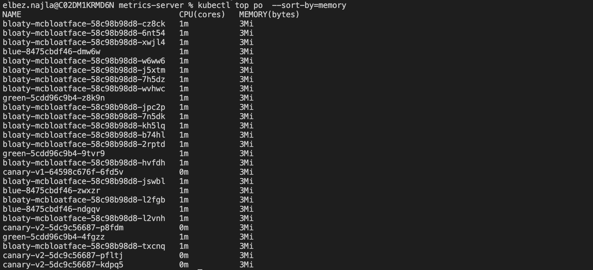

# Project: Deployment Roulette


## Step 1: Deployment Troubleshooting


### Fix the hello-world App Deployment


The `apps/hello-world` deployment is facing deployment issues as the health check was miconfigured 


Screenshot of a successful health check 


```
 kubectl logs hello-world-698dfc7f8-2cqv2
```


## Step 2: Canary Deployments


````
for i in $(seq 1 20); do curl  172.20.191.186; done > canary.txt 
````

## Step 3: Blue-green Deployments

Using the `curl ec2` instance to curl the `blue-green.udacityproject` URL


Commented the resource block creating the record for blue deployment and run `terraform apply`


## Step 4: Node Elasticity

Deploy `apps/bloatware` microservice via `kubectl apply -f bloatware.yml `


### Screenshot of unsuccessful deployment 

The reason why the deployment failed is `0/2 nodes are available: 2 Insufficient cpu.`


Delete the deployment and implement scaling automation
### Resolution steps

Edit `eks.tf` 

````
  nodes_desired_size = 2
  nodes_max_size     = 10
  nodes_min_size     = 1
````

Run `terraform apply` 

Setup OIDC provider


   eksctl utils associate-iam-oidc-provider \
   --cluster udacity-cluster \
   --approve \
   --region=us-east-2


Create a cluster serviceaccount with IAM permissions.

       eksctl create iamserviceaccount \
       --name cluster-autoscaler \
       --namespace kube-system \
       --cluster udacity-cluster \
       --attach-policy-arn "arn:aws:iam::434616981467:policy/udacity-k8s-autoscale" \
       --approve \
       --override-existing-serviceaccounts \
       --region=us-east-2

    
Run `cluster_autoscale.yml` configuration


    kubectl apply -f cluster_autoscale.yml

Redeploy the eploy `apps/bloatware` microservice


    kubectl apply -f bloatware.yml 


List all pods in all namespaces


    kubectl get pods --all-namespaces > node-elasticity.txt

## Step 5: Observability with Metrics

Apply the `metrics-server.yml` configuration 

    kubectl apply -f metrics-server.yml

Get the list of pods sorted by memory 

    kubectl top po --all-namespaces --sort-by=memory



After deleting the service with the most memory usage from the cluster
   
    kubectl delete -f cluster_autoscale.yml       
    kubectl top po --all-namespaces --sort-by=memory

